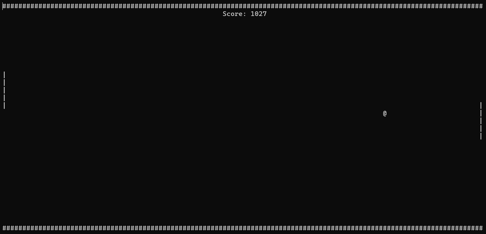
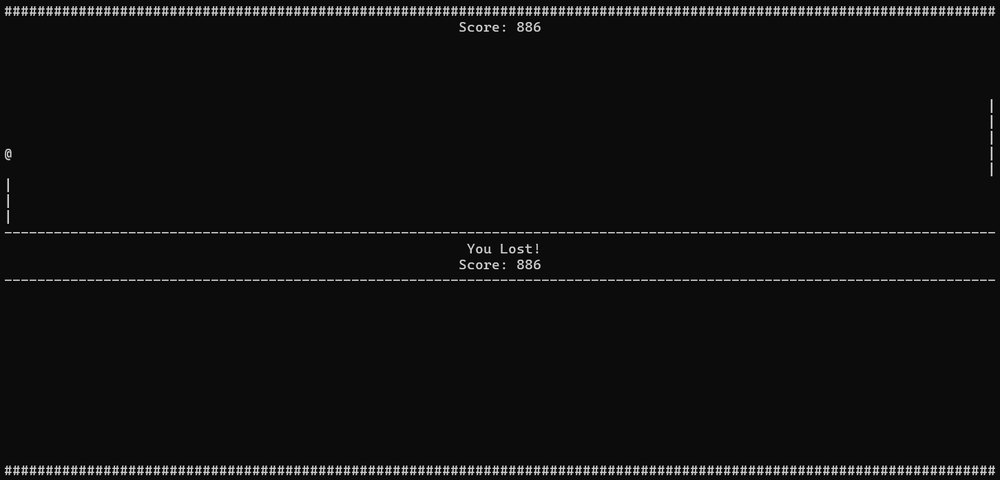

# Pong-Console
Pong game implemented in Console using C++

---
### How to run
1. Compile:
	- Open cmd in directory with files and call ``compile.bat``. *(Ignore warnings)*
2. Run
	- Open ``pong.exe`` file
3. Enjoy your fails >:3

---
### Screenshots

